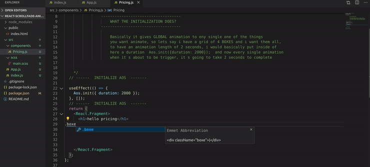

## APP (in Progress)

#### There are many libraries to make "animation effects on page scroll" easier for us. AOS, also called Animate on Scroll, is one such library and it does exactly what its name suggests: it lets you apply different kinds of animations to elements as they scroll into view.

<p>There are several types of animation you can choose from. For example, you can add fade animations like “fade”, “fade-up” and “fade-down-left”. Similarly, you can also add flip and slide animations like “flip-up”, “flip-left”, “slide-down”, and “slide-right”.</p>

<br>
<br>

<h5>Here, you will learn about the inner workings of AOS, how to install the library and get it to work. By the end of this tutorial, building animations on scroll for your clients will be a breeze.</h5>

https://www.sitepoint.com/cool-scroll-animations-made-easy-aos-library/ - source!
[Link](https://www.sitepoint.com/)

<!--  -->

<!-- https://www.youtube.com/watch?v=JcHLxzrsRS4 -->

<hr>

```javascript

npm i react

npm i react-dom

npm i react-scripts

npm i node-sass --save

npm i autoprefixer@9.8.0

npm i gh-pages --save-dev

npm i react-router-dom

npm i aos --save
```

### Initialization


